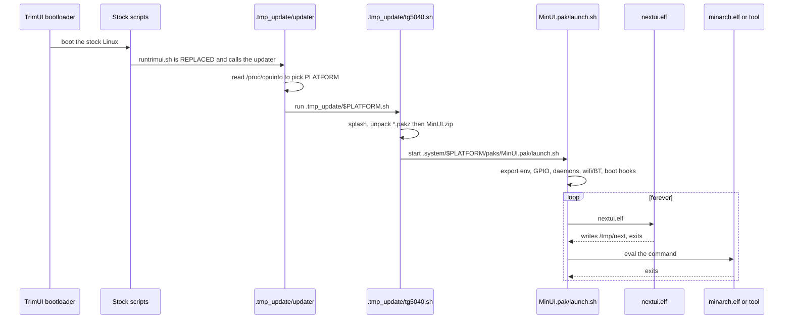

# Boot chain



## 1. The hijack

Stock firmware runs `/mnt/SDCARD/trimui/app/runtrimui.sh` at boot. NextUI
**replaces that file** with a script calling its own updater, falling back to
`runtrimui-original.sh` when NextUI is not installed. `skeleton/BOOT/common/` is
renamed `.tmp_update` by the makefile's `special:` target.

## 2. Platform detection

`skeleton/BOOT/common/updater` sniffs `/proc/cpuinfo`:

```sh
*"TG5040"*|*"TG3040"*|*"TG4040"*)  PLATFORM="tg5040"
*"TG5050"*)                        PLATFORM="tg5050"
```

## 3. Install / update

`.tmp_update/$PLATFORM.sh` (from `workspace/<platform>/install/boot.sh`):

1. shows a splash via `show2.elf --mode=daemon`;
2. unpacks every `*.pakz` at the card root, running their `post_install.sh`;
3. if `MinUI.zip` is present, **wipes** `.system/<plat>/{bin,lib,paks/MinUI.pak}`
   and unpacks — hence the rule that `.system` holds nothing personal;
4. runs `.system/<plat>/bin/install.sh`;
5. starts `MinUI.pak/launch.sh`.

## 4. The runtime environment

`MinUI.pak/launch.sh` is the single most useful file to read. In order:

- **early exits** — `/tmp/poweroff` or `/tmp/reboot` present means act now;
- **environment** — every `*_PATH`, plus `HOME`;
- **model detection** — `TRIMUI_MODEL` from `strings /usr/trimui/bin/MainUI`;
- **hardware GPIO** — 5 V rail (PD11), rumble motor (PH3), Smart Pro side pads,
  DIP switch (PH19, used as mute);
- **library paths** — NextUI binaries go *before* the vendor's, but can still
  fall back to them:

  ```sh
  export LD_LIBRARY_PATH=$SYSTEM_PATH/lib:/usr/trimui/lib:$LD_LIBRARY_PATH
  export PATH=$SYSTEM_PATH/bin:/usr/trimui/bin:$PATH
  ```

- **daemons** — `trimui_inputd`, `governor.sh auto`, `keymon.elf`, `batmon.elf`,
  `audiomon.elf`;
- **networking** — Wi-Fi and Bluetooth state is read from config *by the shell*
  through `nextval.elf`, and the init scripts are copied over the system's own
  on every boot;
- **user scripts** — legacy `auto.sh`, then the boot hooks.

## 5. The main loop

See [runtime-model.md](runtime-model.md).
