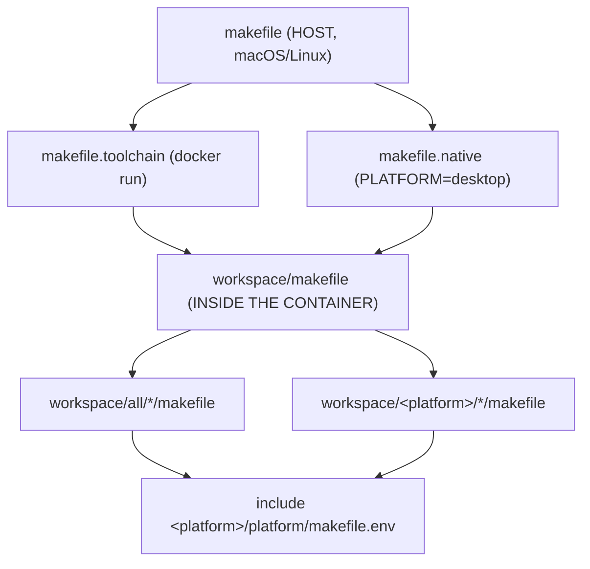

# Build system

## Three makefile levels



The root makefile runs on the host on purpose — otherwise the build would be
running Docker inside Docker.

## Prerequisites

Docker or Podman (auto-detected), git, make, curl, zip, jq, zipmerge
(`brew install libzip` / `apt install zipmerge`), and adb for deploying.

## Commands

```sh
make all                        # both platforms + packaging
make PLATFORM=tg5040 build      # compile one platform
make PLATFORM=tg5040 shell      # interactive toolchain shell
make deploy                     # build, adb push, reboot
```

`PLATFORMS = tg5050 tg5040` at the top of the makefile.

| Target | Effect |
|---|---|
| `setup` | wipe `./build`, copy `skeleton/` into it, write `workspace/hash.txt` |
| `build` | delegate to `makefile.toolchain` (or `.native` for desktop) |
| `system` | copy compiled `.elf`/`.so` into `build/SYSTEM/` and into the Tool paks |
| `cores` | copy `*_libretro.so` into `SYSTEM/cores` or the Emu paks |
| `build-core CORE=x` | compile a single core |
| `special` | rename `BOOT/common` to `.tmp_update` |
| `package` | write `version.txt` + `commits.txt`, build `MinUI.zip`, fetch vendored `.pakz`, merge release zips |

The makefile refuses `make PLATFORM=tg5040` with no target, on purpose.

## The container

```make
IMAGE_NAME = ghcr.io/loveretro/$(PLATFORM)-toolchain:latest
CONTAINER_RUNTIME ?= $(shell command -v docker || command -v podman)
```

- Only `workspace/` is mounted; `skeleton/` and packaging stay on the host.
- The toolchain repo is cloned into `toolchains/` on first build; the image comes
  from GHCR.
- A guard records the runtime in `workspace/.container_runtime` and cleans
  root-owned artifacts when switching between Docker and Podman.

## Two conflict hotspots

Adding an application means editing two hardcoded lists:

- `workspace/makefile` — one `cd ./all/<app>/ && make` line per app;
- `makefile`, `system:` target — one `cp` line per binary.

Both are append-only lists, which conflict on adjacent lines at every sync. Seam
C in [../fork-strategy.md](../fork-strategy.md) replaces them with
auto-discovery.
