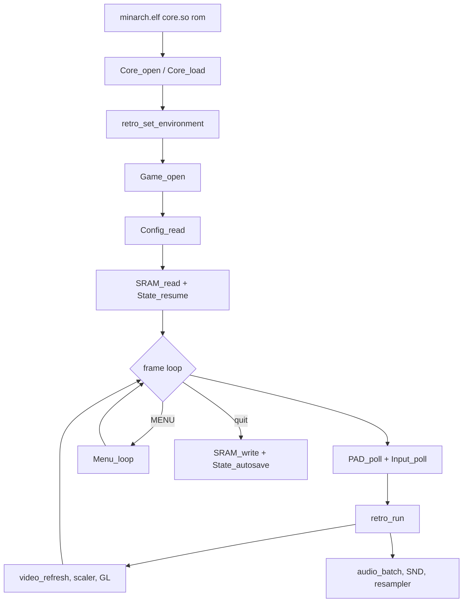

# Emulation — `minarch`

`minarch.elf` is NextUI's minimal RetroArch equivalent. It `dlopen`s a libretro
core, feeds it a ROM, implements the libretro callbacks, and draws the in-game
menu. Inherited from MinUI (itself derived from `picoarch`) but largely rewritten
— it is NextUI's main technical contribution over MinUI.

## Structure

Unlike the launcher (one 3435-line file), `minarch` is modular.

| File | Lines | Role |
|---|---|---|
| `minarch.c` | 378 | entry point, global frontend state |
| `ma_core.c` | | `dlopen`, binding the `retro_*` symbols |
| `ma_game.c` | | ROM loading (zip, chd, m3u) |
| `ma_environment.c` | | the `RETRO_ENVIRONMENT_*` callback |
| `ma_runframe.c` | | the frame loop |
| `ma_video.c` | 996 | `retro_video_refresh` → scaler → GL |
| `ma_audio.c` | | `retro_audio_sample_batch` → `SND_*` |
| `ma_input.c` | | RetroPad mapping, turbo, fast-forward |
| `ma_menu.c` | 2082 | the in-game menu |
| `ma_options.c` | | core-exposed options |
| `ma_frontend_opts.c` | 728 | frontend options (scaling, shaders, sync) |
| `ma_config.c` | 1734 | reading/writing `minarch.cfg` |
| `ma_saves.c` | | SRAM, RTC, savestates |
| `ma_cheats.c`, `ma_rewind.c` | 741 | cheats, LZ4 rewind |
| `chd_reader.c` | 467 | CHD reading |
| `ra_integration.c` | 2930 | RetroAchievements |

## Flow

Frontend state lives in globals in `minarch.c` — direct, and consistent with only
one game ever running at a time.

## For the fork

`ma_menu.c` and `ma_config.c` are dense with string literals (29 SDL_ttf call
sites in `ma_menu.c` alone). Any i18n approach that rewrites them in place is the
expensive one; see seam B in [../fork-strategy.md](../fork-strategy.md).
