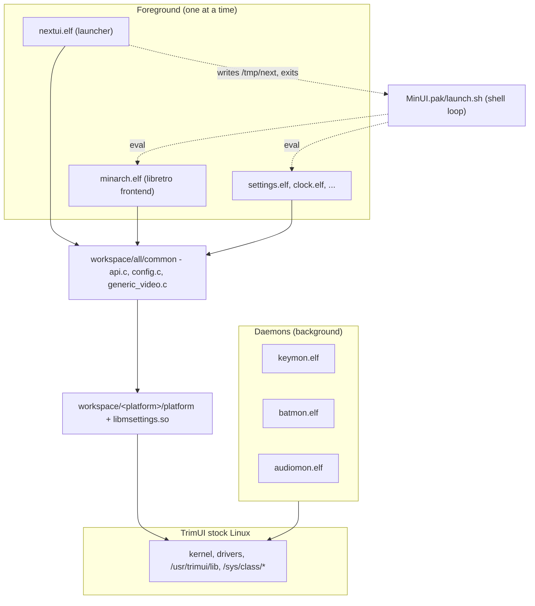

# NextUI architecture

Condensed from the hand-written French wiki that documents upstream NextUI.
Paths are relative to the repository root.

| Page | Covers |
|---|---|
| [runtime-model.md](runtime-model.md) | One process at a time, the shell loop, sentinel-file IPC |
| [repo-layout.md](repo-layout.md) | `skeleton/` vs `workspace/` |
| [boot-chain.md](boot-chain.md) | From the stock bootloader to the launcher |
| [platform-layer.md](platform-layer.md) | The `PLAT_*` contract, weak symbols |
| [build-system.md](build-system.md) | Three makefile levels, the container toolchain |
| [paks-and-hooks.md](paks-and-hooks.md) | The extension system |
| [emulation.md](emulation.md) | `minarch`, the in-house libretro frontend |
| [system-services.md](system-services.md) | keymon, batmon, audiomon, show2 |

## The whole system

## Languages

| Language | Where | Why |
|---|---|---|
| C (gnu99) | launcher, minarch, common, daemons | inherited from MinUI |
| C++17 | `settings/`, `audiomon/`, `show2/` | newer code; `settings` has a real widget framework |
| POSIX shell | paks, boot, installer, hooks | the extension system |
| GLSL | `skeleton/**/shaders/` | video shaders |

No Lua, no JSON, no embedded interpreter. All configuration is plain-text
`key=value`; all extension logic is shell.

## Cheat sheet

| To change… | Look at |
|---|---|
| a widget's appearance | `workspace/all/common/api.c` (`GFX_blit*`) + `skeleton/SYSTEM/res/assets.svg` |
| layout metrics | `workspace/all/common/defines.h` + `workspace/tg5040/platform/platform.h` |
| menu navigation | `workspace/all/nextui/nextui.c` |
| add a setting | `config.h` → `config.c` → `settings/settings.cpp` |
| the GL compositor | `workspace/all/common/generic_video.c` |
| add an emulated system | see [paks-and-hooks.md](paks-and-hooks.md) |
